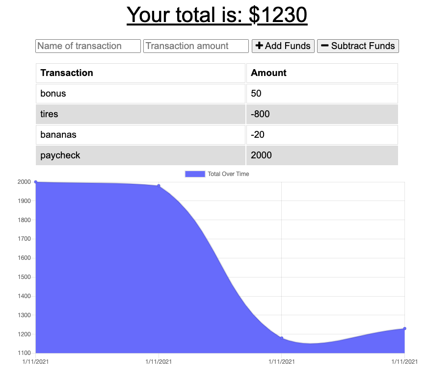

# PWA-budget-tracker

A progressive web app that allows you to track your personal budget on a daily basis. You can add or remove funds (transactions) with data being stored in a cloud NoSQL dB. A total over time line chart is provided to allow visual tracking of account historical balance. As this is a webapp and in the event your internet connection is disrupted, you can still continue to use the app offline. Whenever the connection is restored, cached data is then immediately pushed to the dB. Mongo DB with an express server in node.js is used to persist data while mongoose is used as an ODM for data modelling. IndexedDB is used for persisting data offline in the browser.
    
- [Installation](#installation)
- [Usage](#usage)
- [License](#license)
- [Contributions](#contributions)
- [Tests](#test)
- [Questions](#questions)
    
## Installation (Local)
    
1. Clone my app repo to your local machine: https://github.com/204039643/PWA-budget-tracker
2. Navigate to the main folder which contains server.js file and run 'NPM Install' in the CLI.
3. If you haven't done so already, install Mongo DB, start Mongo server, and instantiate a new DB called 'budget'. Note: there are no seeds for this DB, this is intentional.
4. Type 'NPM start' to start app, instantiate express server, and access Mongo dB.
5. Navigate to localhost:3000 in your browser to use app locally.
    
## Usage
    
1. Open deployed in your favorite browser: https://peaceful-journey-73414.herokuapp.com/
2. On main page you will find a form to input transactions and a ledger of all of transaction history, at the top, and a line chart of historical transactions at the bottom. You can either: add or remove funds depending on your transaction type.
3. Simply add a transaction description and click either 'add funds' or 'remove funds'.
4. Both the ledger and line chart will update with latest transaction record automatically.
5. Offline usage:
- in the event of loss of internet connectivity, you can simply continue to use the app as you normally would
- upon restoration of connection, cached transactions will be immediately pushed to the cloud dB.
- if you would like view cached data: open developer tools > application tab > in LH tab under 'Storage' > IndexedDB > budget dB > pending (displays key value pairs of stored records/documents)
    
## License
    
MIT
    
Copyright (c) [2021] Justin Sykes
    
Permission is hereby granted, free of charge, to any person obtaining a copy
of this software and associated documentation files (the "Software"), to deal
in the Software without restriction, including without limitation the rights
to use, copy, modify, merge, publish, distribute, sublicense, and/or sell
copies of the Software, and to permit persons to whom the Software is
furnished to do so, subject to the following conditions:
    
The above copyright notice and this permission notice shall be included in all
copies or substantial portions of the Software.
    
THE SOFTWARE IS PROVIDED "AS IS", WITHOUT WARRANTY OF ANY KIND, EXPRESS OR
IMPLIED, INCLUDING BUT NOT LIMITED TO THE WARRANTIES OF MERCHANTABILITY,
FITNESS FOR A PARTICULAR PURPOSE AND NONINFRINGEMENT. IN NO EVENT SHALL THE
AUTHORS OR COPYRIGHT HOLDERS BE LIABLE FOR ANY CLAIM, DAMAGES OR OTHER
LIABILITY, WHETHER IN AN ACTION OF CONTRACT, TORT OR OTHERWISE, ARISING FROM,
OUT OF OR IN CONNECTION WITH THE SOFTWARE OR THE USE OR OTHER DEALINGS IN THE
SOFTWARE.
    
## Contributions
    
- Jquery (https://www.jquery.com)
- NPM packages: express (https://www.npmjs.com/package/express), morgan (https://www.npmjs.com/package/morgan), mongoose (https://www.npmjs.com/package/mongoose), compression (https://www.npmjs.com/package/compression)
- IndexedDB API (https://developer.mozilla.org/en-US/docs/Web/API/IndexedDB_API)
- Heroku (www.heroku.com)
    
## Tests
    
None
    
## Questions?
Please reach out to me at either of the following:
GitHub username: 204039643
Email: atlsykes1@att.net
    
    
 ---This README was generated using nice-readme-generator :-) ---